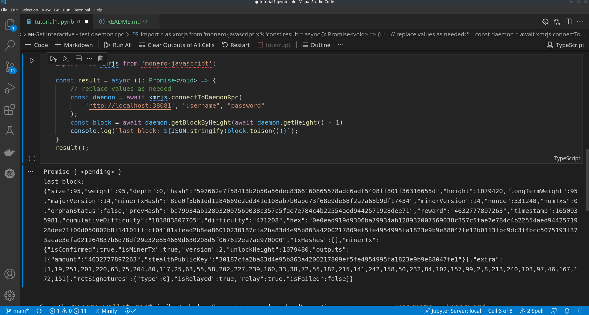

# Monero Dev Guides

Interactive dev guides with Typescript, monero-javascript and tslab.
Learn at your own pace. Build cool stuff with Monero.

## Prerequisites

* Linux - optional but highly recommended (ubuntu and mint are user friendly)
* `monero-wallet-rpc` binary from getmonero.org downloads or [monero-project releases](https://github.com/monero-project/monero/releases/)
* node.js install with [nvm](https://github.com/nvm-sh/nvm)
    * `nvm install 16`
    * `node -v && npm -v`
* [Jupyter](https://jupyter.org/install)
* [tslab](https://github.com/yunabe/tslab)
* VSCode with Jupyter Notebook extension, optional but hella clutch
* [Mastering Monero](https://masteringmonero.com/book/Mastering%20Monero%20First%20Edition%20by%20SerHack%20and%20Monero%20Community.pdf)
* Know how to look up APIs in the [developer guides](https://www.getmonero.org/resources/developer-guides/) and rpc docs

If you made it through all that you are a candidate

* `git clone https://github.com/hyahatiph-labs/hlc && cd xmr-dev-guides && npm i`
* open up the `.ipynb` files in vscode or jupyter notebook
* Bookmark monero-javascript documentation
    * open locally in your browser
    * `file:///${HOME}/hlc/xmr-dev-guides/node_modules/monero-javascript/docs/index.html`

## Syllabus

If you already know everything from the prerequisites then you probably will be bored here.

Or if you just want to audit the material that is fine too. Here is the syllabus:
* tutorial 1 - the setup
    * daemon rpc test
    * wallet rpc test
* tutorial 2 - the daemon rpc
    * mini block explorer in Jupyter Notebook
    * Fee calculation
* tutorial 3 - the wallet rpc
    * Create a functional wallet in Jupyter notebook
    * Create a Multisig Wallet in Jupyter notebook

## Goals

What this material should do
* get you intimate with the monero-javascript library
* teach you how to integrate monero into web apps
* motivate the community to build more and create a circular economy around monero

What this material won't do
* give you superpowers
* teach how to code in general
* make you rich

## Recommendations / Requests

just create an issue on this repo

### Don't Give Up

If you feel intimidated or get stuck we have help in the [monero community irc](https://app.element.io/#/room/#monero-community:monero.social)
